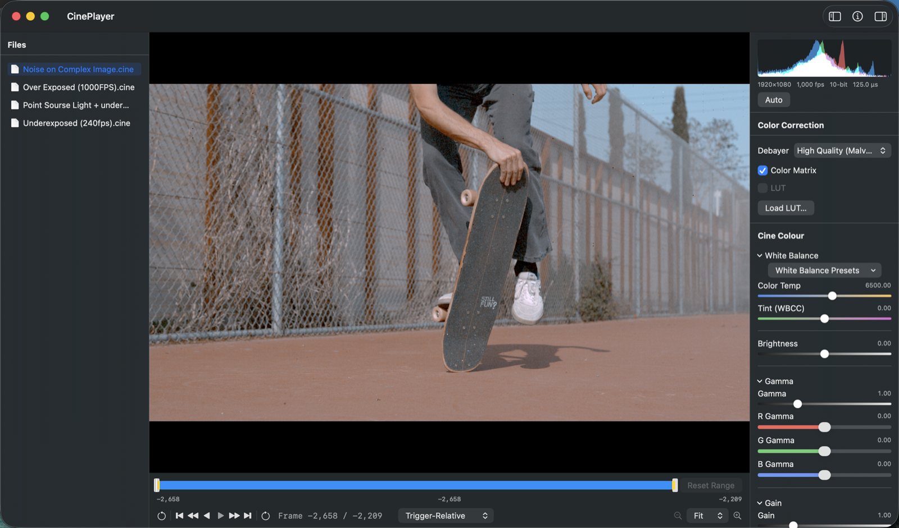

# CinePlayer

A native macOS SwiftUI/Metal viewer for `.cine` files — the proprietary
high-speed camera format written by Vision Research/AMETEK Phantom cameras.
It's built for vision-research and high-speed-imaging work: opening a
capture, scrubbing/playing it back at various speeds (including true
native-capture-fps real-time playback), switching between raw-sensor and
demosaiced views, and pulling out individual frames as PNG or raw DNG.



Have a feature you'd like to see, or run into something that doesn't work the way you'd expect? I'd genuinely love to hear about it — please open an issue! I'm always happy to take a look and see what I can add.

## Installing

- Requires **macOS 26 (Tahoe) or later**.
- Download the latest `CinePlayer-*.zip` from this repo's
  [Releases](../../releases) page, unzip it, and move `CinePlayer.app` to
  `/Applications` (or wherever you keep apps).
- **First launch**: CinePlayer isn't code-signed or notarized (see Known
  Limitations below), so Gatekeeper blocks a plain double-click the first
  time with an "Apple could not verify..." warning. Right-click (or
  Control-click) `CinePlayer.app` and choose Open, then confirm Open in the
  dialog that follows — only needed once per download, after that it opens
  normally.

Prefer to build it yourself instead? See "Building from source" under For
developers below.

## Features

Everything below is wired up in the current code, not aspirational:

- **Opening a file**: File → Open File… (⌘O) / Open Folder… (⌘⇧O), or drag
  a `.cine` file or a folder straight onto the window.
- **Playback transport**: a 6-speed fixed-skip transport — reverse
  4x/2x/1x, forward 1x/2x/4x — plus 2 independent **real-time** buttons
  that play at the clip's actual native capture fps rather than the fixed
  ~30fps review cadence the 6 rate buttons use. Space/←/→/Shift+←/→/Home/End
  keyboard shortcuts all work.
- **Scrubbing**: a full-range slider that pauses and seeks.
- **5 debayer/display modes**, picked from a toolbar menu: Raw Sensor,
  Grey Scale, Nearest Neighbor, Bilinear, and High Quality (Malvar-He-Cutler
  gradient-corrected demosaic). Switching modes only changes how the
  already-decoded frame is interpreted for display — it never triggers a
  re-decode.
- **Cine Colour panel**: a live histogram, an Auto exposure button, camera
  metadata (resolution, capture fps, bit depth, shutter speed), White
  Balance presets with Kelvin values, and Brightness/Gain/Gamma/Hue/
  Saturation/Color Temp/Tint sliders — click any numeric readout to type an
  exact value. This grade is purely live/session state: it's reset to
  neutral every time a file is opened and is **never persisted anywhere**
  (no sidecar file, and nothing is written into the `.cine` file itself —
  Vision Research's `SETUP` struct has no field for it and is treated as
  read-only). Its only lasting effect is whatever gets baked into a frame
  or video export while it's dialed in.
- **Color-matrix toggle**: a checkbox that turns the post-demosaic
  color-correction matrix stage on/off; white balance is applied either
  way. See Known Limitations below for why this exists.
- **Save / Save As**: only ever trims. If an in/out range is set, ⌘S
  overwrites the `.cine` file in place with just that frame range (behind a
  confirmation naming how many frames would be discarded); ⌘⇧S always
  writes a trimmed copy to a new file instead. With no trim set, ⌘S does
  nothing. Neither ever touches the Cine Colour grade — see the note above.
- **Frame export**: File → Export → Current Frame as Still… saves the
  currently-displayed frame as PNG, 16-bit TIFF, JPEG, 16-bit DPX, or Raw
  DNG (the last one writes the frame's _undemosaiced_ raw Bayer mosaic plus
  real per-file calibration metadata to a genuine Adobe DNG file, openable
  in Lightroom/Capture One/Core Image's own RAW pipeline) — one save panel,
  format picked from a dropdown.
- **Video export**: File → Export → Export Video… encodes a frame range to
  a standard video file (ProRes/H.264/HEVC).
- **Batch conversion**: `cine-batch-convert` (a command-line tool, see For
  developers below) converts every `.cine` file in a directory to video
  without opening the GUI.

## Known limitations

- **Color-matrix residual color cast**: the post-demosaic color-correction
  matrix decoded from a file's `SETUP.cmCalib` has been found to overshoot
  into a visible magenta cast on every real sample file tested — some
  samples' stored calibration metadata appears to be left over from a
  different shooting session than the footage it's attached to. The app's
  fix today is the manual "Color Matrix" toggle in the playback toolbar:
  turning it off falls back to an identity matrix while **white balance
  keeps applying either way** (only the matrix stage is affected). Separately,
  `CinePlayerCore` also has an automatic `CalibrationPlausibility` heuristic
  that vetoes a calibration when applying it measurably pushes a frame's own
  bulk statistics away from neutral — but that check is currently wired only
  into the `cine-diagnostic` CLI tool, not into the main app's
  `CineDocumentModel`, so in the GUI the manual toggle is the only recourse
  today.
- **P12L (12-bit packed) pixel unpacking is unverified against real data.**
  The bit-unpacking logic is ported from a working open-source reference and
  looks correct by inspection, but none of the real captures this project
  has been tested against use P12L (`biCompression == 1024`) — only
  uncompressed and P10-packed frames have actually been exercised end-to-end.
  Treat P12L as unverified until tested against a real capture.
- **VRI and VRI-v6 CFA families are untested.** Every real capture this
  project has been tested against reports `CFA == 3` ("BAYER"). The
  `.vri`/`.vriV6` cases in `CFAPattern`/`CFAPhase`
  are implemented from the format's documented pattern names, but no real
  sample using either has ever been seen, so their CFA-phase assumptions are
  unverified guesses, not empirically calibrated the way the Bayer path was.
- **No code signing or notarization.** `CODE_SIGN_STYLE` is `Automatic`
  with no `DEVELOPMENT_TEAM` configured, `ENABLE_HARDENED_RUNTIME` is `NO`,
  and there's no App Store distribution path — this is an internal/
  direct-distribution tool, signed only "to run locally" by default.

## For developers

CinePlayer is built on [CineKit](https://github.com/ryanjohnsontv/CineKit),
a from-scratch, independently reversed and tested `.cine` parser that lives
in its own repo, plus a Swift package and a small set of command-line
tools that live alongside the app in this repo.

### Building from source

Requires **Xcode 26+** (the full Xcode.app, not just the Command Line
Tools — see the troubleshooting note below). Verified against Xcode 26.6
(build 17F113) on macOS 26.5.2.

Open `CinePlayerApp/CinePlayer.xcodeproj` in Xcode, select the `CinePlayer`
scheme, and Build/Run.

From the command line, the equivalent is:

```sh
cd CinePlayerApp
xcodebuild -project CinePlayer.xcodeproj -scheme CinePlayer -configuration Debug build
```

**Troubleshooting — "tool 'xcodebuild' requires Xcode":** if `xcode-select
-p` points at `/Library/Developer/CommandLineTools` instead of a full
Xcode install (common on machines that installed the CLT before Xcode
itself, or switched at some point), both `xcodebuild` and `swift test`
(in `CinePlayerCore`) fail — the latter with `no such module 'Testing'`,
since Swift Testing ships with the full Xcode toolchain, not
CommandLineTools. Prefix the command with the full toolchain instead of
running `xcode-select --switch` (which changes global system state):

```sh
DEVELOPER_DIR=/Applications/Xcode.app/Contents/Developer swift test
DEVELOPER_DIR=/Applications/Xcode.app/Contents/Developer xcodebuild -project CinePlayer.xcodeproj -scheme CinePlayer -configuration Debug build
```

A tagged push (`git push origin vX.Y.Z`, tag matching `v*`) triggers
`.github/workflows/release.yml`, which builds this same Release
configuration, zips `CinePlayer.app`, and attaches it to a new GitHub
Release — the same artifact "Installing" above downloads.

### Architecture

```text
CineKit  (pure Swift, Foundation-only .cine parsing/decoding — no
          AppKit/Metal — its own package, independently testable)
   ↓
CinePlayerCore  (SwiftUI/Metal rendering + playback state — a Swift package,
                 `CinePlayerCore/`)
   ↓
CinePlayerApp  (thin Xcode app target: windows, menus, panels, export UI —
                `CinePlayerApp/`)
```

`CineKit` decodes a `.cine` file down to raw per-pixel `UInt16` sensor
values and hands back a `CineFile`/`DecodedFrame` — no tone-mapping, no
demosaicing, no GPU involvement, so it's testable with nothing but `swift
test`. `CinePlayerCore` owns the actual playback/document state
(`CineDocumentModel`, `PlaybackController`, `DecodedFrameCache`) and the
Metal render pipeline (`CineRenderer` + `Tonemap.metal`, which does
black/white leveling, debayering, white balance/color matrix, and gamma
entirely in the fragment shader — CPU-side decode never re-runs just
because an exposure or display setting changed). `CinePlayerApp` is a thin
Xcode application target wiring that core into actual windows, menus, an
`NSOpenPanel`, and export commands.

`CinePlayerCore/Sources/` also has a few command-line tools built from the
same package:

- **`cine-diagnostic`**: decodes one frame of a `.cine` file to a PNG,
  given a debayer mode — the quickest way to check a rendering change
  without launching the full app.
- **`cine-scrub-bench`**: drives `DecodedFrameCache` through playthrough/
  scrub scenarios and reports decode counts, cache footprint, and process
  RSS, to verify the cache is actually bounded rather than just "looks
  right."
- **`cine-lut-verify`**: renders a real frame through the real
  `CineRenderer`, with and without two small synthetic `.cube` LUTs bound,
  and asserts the read-back pixels are exactly what those LUTs should
  produce — an end-to-end check that LUT sampling is actually correct, not
  just that it builds.
- **`wb-verify`**: an independent regression check that opening a file
  through the live app's real code path (`CineDocumentModel.open(url:)`)
  computes the same white-balance gains/color matrix as the original
  convenience initializer did, to catch any accidental drift between the
  two.
- **`cine-batch-convert`**: converts every `.cine` file in a directory to
  video, headless (see "Batch conversion" under Features above).

Run any of them with `swift run` from `CinePlayerCore` (builds first if
needed):

```sh
cd CinePlayerCore
swift run cine-diagnostic <path-to-cine-file> <frameIndex> <output-png-path> [mode]
swift run cine-scrub-bench <path-to-cine-file> <playthrough|scrub> <capacity>
swift run cine-lut-verify <path-to-cine-file>
swift run wb-verify <path-to-cine-file> [more paths...]
swift run cine-batch-convert <input-directory> [options]
```

Each prints its own usage message (a one-liner for most; the full options
list, shown above, for `cine-batch-convert`) if called with missing or
invalid arguments.

[xcodegen](https://github.com/yonaskolb/XcodeGen) is only needed if you
edit `CinePlayerApp/project.yml` and want to regenerate the `.xcodeproj`.
It is _not_ required just to build: the generated `CinePlayer.xcodeproj`
is already tracked in git, and building it directly works with no
regeneration step.

### Development notes

- `CineRenderer`'s tone-mapping pipeline (`Tonemap.metal`) is the single
  render path shared by the live `MTKView` delegate, PNG export, and the
  `cine-diagnostic` CLI — if you need to change tone-mapping behavior,
  there is exactly one place to do it.
- For anything touching the `.cine` format itself (parsing, pixel
  unpacking, `SETUP` fields) or CineKit's own test suite, see
  [CineKit](https://github.com/ryanjohnsontv/CineKit) — that's a separate
  repo with its own README, tests, and contributor notes.
